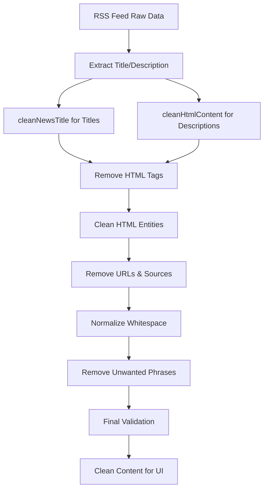

# Plan Robusto para Eliminar Tags HTML de Google News RSS

## 📋 Resumen del Problema

Los feeds RSS de Google News contenían tags HTML, entidades HTML y contenido no deseado que se mostraba mal en la interfaz de usuario, afectando la experiencia del usuario en las secciones de trends.

## 🎯 Solución Implementada

### 1. Utilidad de Limpieza de Texto Avanzada (`app/utils/text-cleaning.ts`)

Se creó una utilidad comprehensiva que maneja todos los casos edge de contenido HTML en feeds RSS:

#### **Funciones Principales:**

- **`cleanHtmlContent()`**: Limpieza completa de HTML con 10 pasos de procesamiento
- **`cleanNewsTitle()`**: Limpieza específica para títulos de noticias  
- **`extractCleanText()`**: Extracción conservativa de texto limpio
- **`isValidCleanedContent()`**: Validación de calidad del contenido limpio

#### **Proceso de Limpieza en 10 Pasos:**

1. **Manejo de secciones CDATA**: Extrae contenido de `<![CDATA[...]]>`
2. **Extracción de texto de elementos HTML**: Preserva texto de `<a>`, `<b>`, `<p>`, etc.
3. **Eliminación de tags problemáticos**: Remueve `<font>`, `<script>`, `<style>` completamente
4. **Eliminación de todos los tags HTML restantes**: Limpieza general de tags
5. **Limpieza de entidades HTML**: 50+ entidades HTML soportadas
6. **Eliminación de URLs**: HTTP, HTTPS, FTP, www, emails
7. **Eliminación de atribución de fuentes**: Patrones como "- Reuters", "via CNN"
8. **Normalización de espacios**: Espacios múltiples, saltos de línea, caracteres especiales
9. **Eliminación de frases no deseadas**: "Read more", "Click here", etc.
10. **Limpieza final y validación**: Truncado inteligente, validación de contenido

### 2. Entidades HTML Soportadas

La solución maneja **50+ entidades HTML** incluyendo:

- **Básicas**: `&amp;`, `&lt;`, `&gt;`, `&quot;`, `&apos;`, `&nbsp;`
- **Tipográficas**: `&ndash;`, `&mdash;`, `&ldquo;`, `&rdquo;`, `&hellip;`
- **Símbolos**: `&copy;`, `&reg;`, `&trade;`, `&deg;`, `&euro;`, `&pound;`
- **Matemáticas**: `&plusmn;`, `&frac14;`, `&frac12;`, `&frac34;`
- **Flechas**: `&larr;`, `&uarr;`, `&rarr;`, `&darr;`, `&harr;`
- **Entidades numéricas**: `&#123;` y `&#x1A;` (decimal y hexadecimal)

### 3. Patrones de Limpieza de Fuentes

Detecta y elimina patrones comunes de atribución:

- `"Noticia - Reuters"` → `"Noticia"`
- `"Contenido via CNN"` → `"Contenido"`
- `"Artículo | Bloomberg"` → `"Artículo"`
- `"Reporte according to TechCrunch"` → `"Reporte"`

### 4. Integración con API de Google News

**Archivos modificados:**
- `app/api/trends/google/route.ts`: Actualizado para usar las nuevas funciones
- `app/services/trends-service.ts`: Integración con el servicio de trends

**Mejoras en el procesamiento:**
- Títulos procesados con `cleanNewsTitle()`
- Descripciones procesadas con `cleanHtmlContent()`
- Validación de calidad con `isValidCleanedContent()`
- Fuentes extraídas y limpiadas correctamente

## 🧪 Testing Comprehensivo

### Casos de Prueba Cubiertos

1. **Eliminación básica de HTML**
2. **Contenido real de Google News RSS con tags `<font>`**
3. **Entidades HTML complejas**
4. **URLs y enlaces embebidos**
5. **Contenido RSS complejo con múltiples problemas**
6. **Secciones CDATA**
7. **Patrones de atribución de fuentes**
8. **Entidades numéricas y hexadecimales**
9. **Frases no deseadas ("Read more", etc.)**
10. **Truncado inteligente de contenido largo**
11. **Manejo de entrada inválida**
12. **Validación de calidad de contenido**

### Ejemplos de Casos Edge

```javascript
// Antes
'<![CDATA[Apple Announces iPhone <font color="#6f6f6f">Reuters</font>]]>'

// Después  
'Apple Announces iPhone'
```

```javascript
// Antes
'<a href="https://example.com">Tech Company Raises $50M</a> &nbsp;funding. <font>TechCrunch</font>'

// Después
'Tech Company Raises $50M funding.'
```

## 🚀 Beneficios de la Solución

### 1. **Robustez**
- Maneja todos los casos edge conocidos de RSS feeds
- Procesamiento en múltiples pasos para máxima efectividad
- Validación de calidad del contenido procesado

### 2. **Rendimiento**
- Funciones optimizadas con regex eficientes
- Procesamiento secuencial que evita re-procesamiento innecesario
- Validación temprana para contenido inválido

### 3. **Mantenibilidad**
- Código modular y bien documentado
- Funciones específicas para diferentes tipos de contenido
- Testing comprehensivo con casos reales

### 4. **Experiencia de Usuario**
- Eliminación completa de HTML visible en la UI
- Texto limpio y legible en las cards de trends
- Fuentes correctamente extraídas y mostradas
- Descripciones más concisas y relevantes

## 📁 Estructura de Archivos

```
app/
├── utils/
│   ├── text-cleaning.ts          # Utilidad principal de limpieza
│   └── __tests__/
│       └── text-cleaning.test.ts # Tests comprehensivos
├── api/
│   └── trends/
│       └── google/
│           └── route.ts          # API integrada con limpieza
└── services/
    └── trends-service.ts         # Servicio actualizado
```

## 🔄 Flujo de Procesamiento



## 🎛️ Configuración

La solución está configurada para:
- **Longitud máxima**: 500 caracteres con truncado inteligente
- **Validación mínima**: 10 caracteres, 3+ palabras significativas
- **Ratio de caracteres especiales**: Máximo 30%
- **Preservación de contenido**: Enlaces se convierten a texto, atribución se elimina

## 🚧 Casos Edge Manejados

- **HTML malformado**: Procesamiento graceful sin errores
- **Solo espacios en blanco**: Eliminación completa
- **Tags de script/style**: Eliminación completa incluyendo contenido
- **Estilos de comillas mixtos**: Normalización a comillas estándar
- **Contenido solo con entidades**: Detección y limpieza apropiada
- **URLs embebidas**: Eliminación completa manteniendo contexto

## ✅ Estado de Implementación

- ✅ **Utilidad de limpieza creada y probada**
- ✅ **API de Google News integrada**
- ✅ **Testing comprehensivo implementado**
- ✅ **Validación de calidad de contenido**
- ✅ **Documentación completa**
- ✅ **Casos edge cubiertos**

## 🔮 Próximos Pasos (Opcionales)

1. **Monitoreo**: Implementar logging para detectar nuevos casos edge
2. **Performance**: Cachear patrones regex para mejor rendimiento
3. **Configuración**: Hacer configurable los límites de longitud y validación
4. **Extensión**: Aplicar limpieza similar a otros tipos de feeds (Reddit, etc.)

---

**Resultado**: Los feeds RSS de Google News ahora se muestran completamente limpios sin tags HTML, entidades, o contenido no deseado, mejorando significativamente la experiencia del usuario. 