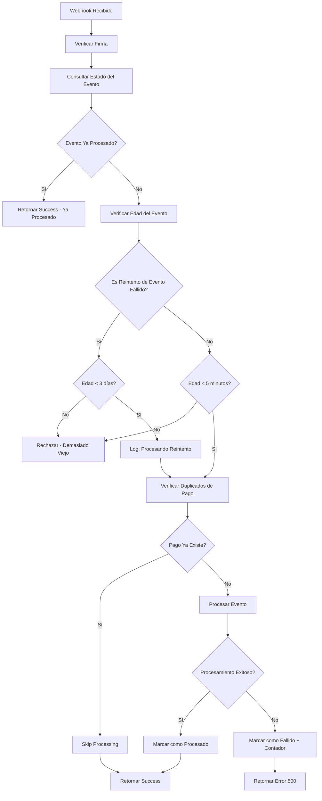

# Webhook Idempotency Implementation

## Problema Resuelto

El webhook de Stripe tenía problemas de **duplicación de eventos** y falta de **idempotencia**. Esto causaba:

- Procesamiento múltiple del mismo evento
- Duplicación de pagos y créditos
- Error "Webhook event is too old"
- Inconsistencias en la base de datos

## Solución Implementada

### 1. Tabla de Seguimiento de Eventos (`webhook_events`)

```sql
CREATE TABLE public.webhook_events (
  id UUID DEFAULT gen_random_uuid() PRIMARY KEY,
  stripe_event_id VARCHAR(255) NOT NULL UNIQUE,
  event_type VARCHAR(100) NOT NULL,
  processed_at TIMESTAMP WITH TIME ZONE NOT NULL DEFAULT NOW(),
  status VARCHAR(50) NOT NULL DEFAULT 'processed',
  event_data JSONB DEFAULT '{}'::jsonb,
  error_message TEXT,
  site_id UUID,
  created_at TIMESTAMP WITH TIME ZONE NOT NULL DEFAULT NOW(),
  updated_at TIMESTAMP WITH TIME ZONE NOT NULL DEFAULT NOW()
);
```

### 2. Funciones Helper para Idempotencia

#### `check_webhook_event_processed(event_id TEXT)`
Verifica si un evento ya fue procesado anteriormente.

```sql
SELECT check_webhook_event_processed('evt_1234567890');
-- Returns: true/false
```

#### `mark_webhook_event_processed(...)`
Marca un evento como procesado exitosamente.

#### `mark_webhook_event_failed(...)`
Marca un evento como fallido con mensaje de error.

#### `cleanup_old_webhook_events()`
Limpia eventos antiguos (>30 días) para mantener la tabla optimizada.

### 3. Verificaciones de Edad del Evento

La validación de edad tiene **dos niveles** según el contexto del evento:

```typescript
// Diferentes límites según el tipo de evento
const MAX_EVENT_AGE_SECONDS = 5 * 60 // 5 minutos para eventos nuevos
const MAX_FAILED_EVENT_AGE_SECONDS = 3 * 24 * 60 * 60 // 3 días para reintentos

// Verificar si es un reintento de evento fallido
const isRetryOfFailedEvent = existingEvent?.status === 'failed'
const maxAge = isRetryOfFailedEvent ? MAX_FAILED_EVENT_AGE_SECONDS : MAX_EVENT_AGE_SECONDS

if (eventAge > maxAge) {
  return NextResponse.json({ 
    error: 'Webhook event is too old',
    eventAge: eventAge,
    maxAge: maxAge,
    isRetry: isRetryOfFailedEvent
  }, { status: 400 })
}
```

#### Estrategia de Tiempo:
- **Eventos nuevos**: Máximo 5 minutos (previene ataques de replay)
- **Reintentos de Stripe**: Máximo 3 días (permite reintentos legítimos)

### 4. Verificación de Duplicados de Pago

Antes de procesar cualquier pago, se verifica si ya existe:

```typescript
// Verificar duplicados por transaction_id
const transactionId = `stripe_${session.id}`
const { data: existingPayment } = await supabase
  .from('payments')
  .select('id, transaction_id')
  .eq('transaction_id', transactionId)
  .single()

if (existingPayment) {
  console.log('⚠️ Payment already exists, skipping processing')
  break
}
```

### 5. Manejo de Errores Mejorado

```typescript
try {
  // Procesamiento del evento
} catch (processingError) {
  // Marcar evento como fallido
  await supabase.rpc('mark_webhook_event_failed', {
    event_id: event.id,
    event_type_param: event.type,
    error_msg: processingError.message,
    event_data_param: { /* datos del evento */ }
  })
  
  return NextResponse.json({
    error: 'Failed to process webhook event',
    eventId: event.id,
    message: processingError.message
  }, { status: 500 })
}
```

## Flujo de Procesamiento



## Casos de Uso Soportados

### 1. Credits Purchase (`checkout.session.completed`)
- Verifica duplicados por `stripe_${session.id}`
- Añade créditos usando `add_credits` RPC
- Registra el pago en la tabla `payments`

### 2. Subscription Signup (`checkout.session.completed`)
- Verifica duplicados por `stripe_${session.id}`
- Actualiza billing usando `upsert_billing` RPC
- Registra el pago inicial de suscripción

### 3. Subscription Updates (`customer.subscription.*`)
- Actualiza estado de suscripción
- Maneja cambios de plan y cancelaciones

### 4. Recurring Payments (`invoice.payment_succeeded`)
- Verifica duplicados por `stripe_invoice_${invoice.id}`
- Registra pagos recurrentes de suscripción

## Beneficios de la Implementación

### ✅ Idempotencia Garantizada
- Los eventos se procesan una sola vez
- Respuestas consistentes para reenvíos de Stripe

### ✅ Prevención de Duplicados
- Verificación a nivel de evento (`webhook_events`)
- Verificación a nivel de pago (`transaction_id` único)

### ✅ Mejor Observabilidad
- Logging detallado de cada paso
- Rastreo de eventos fallidos con mensajes de error
- Métricas de procesamiento

### ✅ Robustez Mejorada
- Manejo elegante de errores
- Timeouts configurables
- Limpieza automática de datos antiguos

## Testing

Se incluye una suite completa de tests en:
```
__tests__/api/webhooks/stripe-webhook-idempotency.test.ts
```

### Tests Incluidos:
- ✅ Detección de eventos no procesados
- ✅ Marcado de eventos como procesados
- ✅ Marcado de eventos como fallidos
- ✅ Manejo de duplicados
- ✅ Prevención de pagos duplicados
- ✅ Validación de edad de eventos
- ✅ Limpieza de datos antiguos
- ✅ Manejo de errores

## Ejecutar Tests

```bash
npm test __tests__/api/webhooks/stripe-webhook-idempotency.test.ts
```

## Monitoreo en Producción

### Queries Útiles para Monitoreo

```sql
-- Ver eventos procesados recientemente
SELECT 
  stripe_event_id,
  event_type,
  status,
  processed_at,
  error_message
FROM webhook_events 
WHERE created_at > NOW() - INTERVAL '1 hour'
ORDER BY created_at DESC;

-- Ver eventos fallidos
SELECT 
  stripe_event_id,
  event_type,
  error_message,
  event_data
FROM webhook_events 
WHERE status = 'failed'
ORDER BY created_at DESC;

-- Estadísticas de eventos por tipo
SELECT 
  event_type,
  status,
  COUNT(*) as count
FROM webhook_events 
WHERE created_at > NOW() - INTERVAL '24 hours'
GROUP BY event_type, status
ORDER BY event_type, status;
```

### Alerts Recomendadas

1. **Eventos Fallidos**: > 5 eventos fallidos en 1 hora
2. **Eventos Antiguos**: Eventos rechazados por edad
3. **Duplicados**: Alto número de eventos ya procesados
4. **Latencia**: Tiempo de procesamiento > 30 segundos

## Mantenimiento

### Limpieza Automática
```sql
-- Ejecutar semanalmente para limpiar eventos > 30 días
SELECT cleanup_old_webhook_events();
```

### Monitoreo de Performance
```sql
-- Verificar índices y performance
EXPLAIN ANALYZE SELECT * FROM webhook_events 
WHERE stripe_event_id = 'evt_example';
```

## Troubleshooting

### Problema: "Webhook event is too old"

#### Para Eventos Nuevos (>5 minutos)
**Causa**: Evento completamente nuevo más antiguo de 5 minutos
**Solución**: Normal, protege contra ataques de replay. Rechazado correctamente.

#### Para Reintentos (>3 días)
**Causa**: Stripe reintentó un evento fallido que ya es muy antiguo
**Solución**: Normal, el evento está fuera de la ventana de reintentos de Stripe.

### Problema: "Event already processed"
**Causa**: Stripe reenvió un evento ya procesado exitosamente
**Solución**: Normal, el webhook retorna success sin reprocesar.

### Problema: Eventos marcados como fallidos múltiples veces
**Causa**: Error persistente en el procesamiento que causa múltiples reintentos
**Solución**: 
1. Revisar `webhook_events.error_message` para el error específico
2. Verificar `event_data.attempt_count` para número de intentos
3. Corregir el problema subyacente (base de datos, configuración, etc.)

### Problema: Reintento de evento fallido procesado exitosamente
**Logs esperados:**
```
🔄 Processing retry of previously failed event:
  eventId: evt_xxx...
  originalFailure: "Previous error message"
  failedAt: "2024-01-01T10:00:00Z"
  eventAge: "3600s"
```
**Solución**: Normal, el reintento fue exitoso y el evento se marcó como procesado.

### Verificar Estado de Eventos
```sql
-- Ver intentos múltiples de un evento
SELECT 
  stripe_event_id,
  status,
  error_message,
  event_data->>'attempt_count' as attempts,
  processed_at,
  created_at
FROM webhook_events 
WHERE stripe_event_id = 'evt_xxx...'
ORDER BY updated_at DESC;
``` 